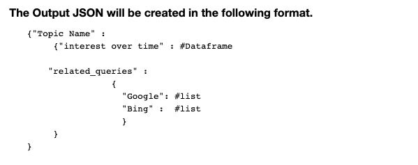

<h3>DSCI_511_Project</h3>
<h1>People's Interests During COVID19 Lockdown: A Review of Search Trends</h1>

<b>Clone the current repository to your local machine using the following line of code:</b>

<pre>
git clone https://github.com/Pawan429/DSCI_511_Project.git
</pre>

<b>Dependencies</b>.   
Install all relevant dependencies using the following code in the Command Prompt.   
<pre>
$ pip install -r requirements.txt
</pre>

<h1>The Dataset</h2>
<b>Problem Statement</b> 
The creation of our dataset began with a thorough discussion of what type of data can the team build and how relevant it could be to the contemporary reality. After a series of discussions, the team resolved on looking into how the prevailing lockdowns due to COVID-19 are impacting people's everyday preferences and choices. The team then set out to explore literature for relevant information. We found an interesting article by Harris & Haasch (2020) in the Business Insider which the team modeled the dataset's variables after. The data/observations for these variables were then obtained from Google Search & Bing search APIs using the Python.  
 
<em>PyTrends module </em> 
<pre>pip install PyTrends</pre>
<em>Azure cognitive services module </em> 
<pre>pip install azure-cognitiveservices-search-websearch</pre>
 
These module(s) allowed us to retrieve data from Google Search Trends and Bing Search Trends, showing data for search queries that people have made by time periods, regions, topics, etc. To further enrich the dataset related queries were brought in from Google Search API and Bing Search API, to create a more holistic view of related searchtrends across the internet during the quarantine.
 

 
<h3>Interacting with the Final Json</h3> 
<h3>Challenges faced during the project</h3> 
<h3>Limitations of the Data</h3>
While our dataset may be useful in many ways, it is equally limited in some respects. First, the data are mere results of people's searches which the project uses as proxy for people's interests. This may not be a comprehensive and realistic consideration of people's interests. Second, the data are not in depth reflections of the actual behavior of the variables, as they were only obtained from Google search engine instead of the actual generators of those data. For example, Netflix related data should better be obtained from netflix instead of Google. Third and importantly, it was difficult to obtain other data sources that could complement our existing google trends dataset. Much of the idea that the team had was not able to retrieve the data or it was just inaccessible. The team believed that a great compliment to google trends data would be from relevant data sources such as Netflix data and/or Amazon search data. Given that these two datasets were publicly unavailable, the team had to come up with other ways to compliment the google trends data. This was challenging, especially so because the global market share of search engines is dominated by Google (92.54%). Since Bing comes in second place with 2.44% of the market share, the team decided to use Bing data to complement its existing google trend data. We thought that if we scraped related search results from Bing and combined it with Google, it would provide a more holistic view of search terms that people were searching during quarantine. This enriched dataset could be used for example in marketing setting, where users could see what people were searching for across multiple search engines, which would give a more accurate pulse of how the average person is reacting to quarantine for a given topic. In the future, the dataset could be improved by obtaining a more realistic data from the actual data generators/owners instead of Google. Also, the dataset could be expanded to cover other trending areas of people's interests during quarantine, which may not have necessarily been covered by the article used by this project.

